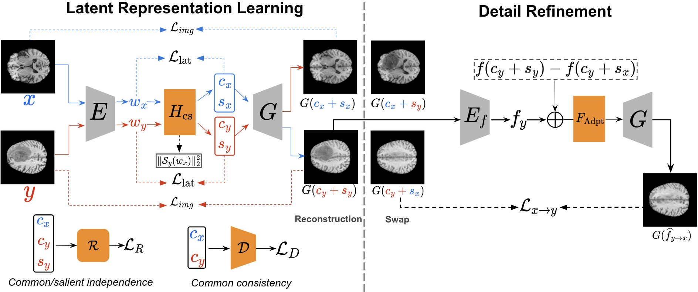
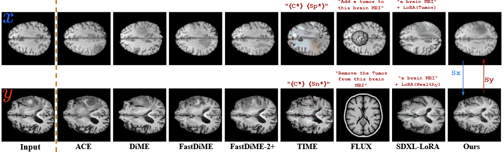
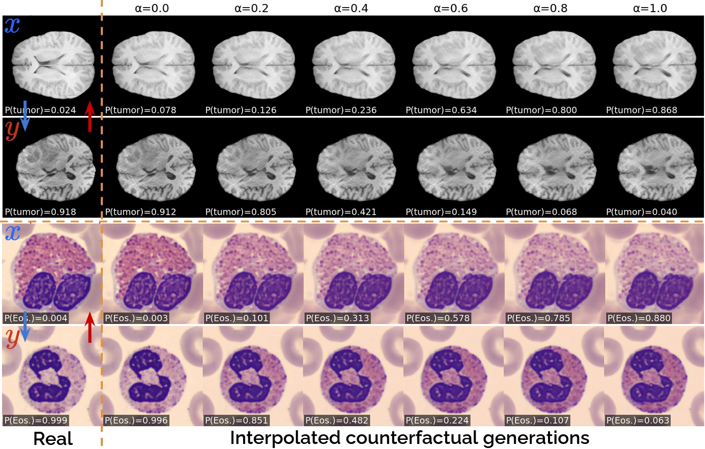

## This repository contains the official implementation of **Counterfactual Contrastive Analysis**.

---

## Overview

We propose a **classifier-free** approach for Visual Counterfactual Explanations (VCEs) based on **Contrastive Analysis (CA)**. Given two datasets **X** and **Y**, we disentangle **common** factors (**c**) and **salient** factors (**s_x**, **s_y**), and generate counterfactuals by **swapping salient factors** while preserving common content. The method is built on **StyleGAN2** and includes an **feature-space (F-space) refinement** stage for higher-fidelity edits.

---

## Framework



Our framework learns disentangled **common** and **salient** factors in latent space, and generates counterfactuals by **swapping salient factors**.

- **Latent Representation Learning:** we disentangle each input into a common factor `c` and a salient factor (`s_x` / `s_y`), enabling reconstruction and CF editing by swapping the salient factors between images from two classes.
- **Detail Refinement:** we refine the swapped synthesis by adjusting **F-space** features according to the common–salient factor manipulation.

---

## Results:



**Comparisons of CF generation**. Cols. 2–5 show CF outputs from SOTA diffusion-based methods. Cols. 6–8 show CF outputs from T2I diffusion models




**Interpolated CF**. The proposed method allows us to generate interpolated counterfactual images between two samples. Along this counterfactual path, the classifier’s predicted probability changes smoothly, suggesting that the generated transformations are semantically meaningful and consistent with the model’s decision boundary.


---

## Repository structure

- `psp_CS-StyleGAN/` : CS-StyleGAN training & inference code (Stage 1)
- `StyleFeatureEditor-CS/` : feature-space refinement modules / utilities (Stage 2)

---

## Environment setup

We recommend using `conda`:

```bash
conda create -n cfca python=3.10 -y
conda activate cfca
pip install -r requirements.txt
```
---

### Architecture / Backbone

Our method is built upon the following works and architectures:

- a **pSp encoder** `E` for inversion ([Richardson et al., 2021](https://arxiv.org/abs/2008.00951)),
- the separator **H_cs** for latent separation, adopted from [He et al., 2025](https://arxiv.org/abs/2402.11928),
- a **StyleGAN2 generator** `G` ([Karras et al., 2019](https://arxiv.org/abs/1912.04958)),
- an **F-space encoder** `E_f` and adapter module `F_Adpt` from [Bobkov et al., 2024](https://arxiv.org/abs/2406.10601).

Unless stated otherwise, we adhere to the original architectures and pretrained configurations provided in the respective official repositories. 
Training is conducted separately for each dataset and its corresponding X/Y split.

---

## Implementation details

### Two-stage training

We train CS-StyleGAN in two stages.

### Stage 1 — Latent separator training (W-space)

We first warm up the separator `H_cs` using latent- and image-reconstruction objectives to reduce the discrepancy between each input and its reconstruction. After ~2,000 warm-up steps, the learned latent factors can reliably recover coarse structure.

We then jointly train `H_cs` with a discriminator `D` and a regularizer/regressors `R` in an alternating manner:
1. update `D` and `R` (maximize their objectives)
2. freeze `D` and `R`, and update `H_cs` (minimize the separator objective)

**Hyperparameters (typical):**
- learning rate: `1e-4` for `D` and `R`, `1e-3` for `H_cs`
- loss weights: `lambda_lat=0.01`, `lambda_D=lambda_R=0.02`, `lambda_lpips=0.8` (others set to 1)
- optimizer: Adam
- training length: ~160k steps

**Example command (BraTS Healthy vs Tumor):**
```bash
python training_scripts/train.py \
  --exp_dir results/Regularization/TEST \
  --exp_scheme baseline_regular_DR \
  --dataset_type bratsHT_new \
  --pSp_checkpoint_path <PATH_TO_PSP_CHECKPOINT>.pt \
  --stylegan_weights <PATH_TO_STYLEGAN2_WEIGHTS>.pt \
  --stylegan_size 256 \
  --data_transform rgb256 \
  --image_interval 2000 \
  --log_interval 100 \
  --val_interval 2000 \
  --save_interval 10000 \
  --n_layers_mlp 12 \
  --optim_name admn \
  --learning_rate 0.001 \
  --special_idx 3 \
  --lat_recon_lambda 1.0 \
  --sbg_lambda 1.0 \
  --l1_lambda 0.0 \
  --l2_lambda 1.0 \
  --id_lambda 0.0 \
  --lpips_lambda 0.8 \
  --max_steps 200000 \
  --num_D_layers 1 \
  --D_lambda 0.05 \
  --D_start_step 2000 \
  --D_mode confusion \
  --num_R_layers 2 \
  --R_lambda 0.05 \
  --R_start_step 2000 \
  --R_mode RegrR
```
---

### Stage 2 — Feature-space refinement (F-space)

After training the separator `H_cs`, we can train the refinement module using latent factors produced by the frozen encoders `E` and `H_cs`, and the corresponding reconstructions generated by `G` from the common/salient latents. We refine swapped outputs in the generator intermediate feature space (F-space) using feature shifts induced by common/salient manipulation.

For the adversarial term, we adopt the StyleGAN2 discriminator `D`, initialized from the pretrained StyleGAN2 model jointly trained with `G`, and fine-tune it during the F-space refinement stage.

**Hyperparameters (typical):**
- `lambda_adv=0.02`, `lambda_lpips=0.8`
- optimizer: Ranger
- learning rate: `2e-4`
- training length: ~200k steps

**Example command (BraTS Healthy vs Tumor):**
```bash
python scripts/train.py \
  exp.exp_dir=./experiments/ \
  exp.config_dir=configs \
  exp.config=fse_cs_editor_train.yaml \
  exp.name=fse_cs_editor_train_new/OCTMNIST/octmnist_x1y2_reg_cs \
  train.train_runner=fse_editor_cs \
  train.start_step=300000 \
  train.direction=two_directions \
  train.log_step=2000 \
  train.val_step=2000 \
  train.checkpoint_step=10000 \
  model.w_space_encoder=pSp \
  model.stylegan_size=256 \
  model.channel_multiplier=1 \
  data.special_idx=-1 \
  data.dataset=bloodmnist_x1y6 \
  data.transform=face_256
```

Finally, in `./StyleFeatureEditor-CS/inference_ipynb`, we provide a series of example notebooks for inference. 

**Note:** the first cell in each notebook initializes the environment (imports, paths, and checkpoints). Please make sure your notebook kernel uses the **same Python environment and installed packages** as the training setup.

